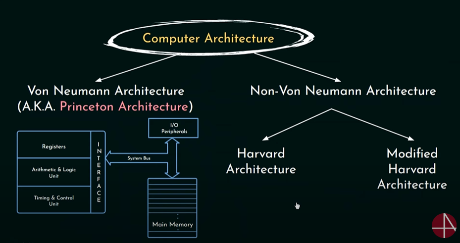
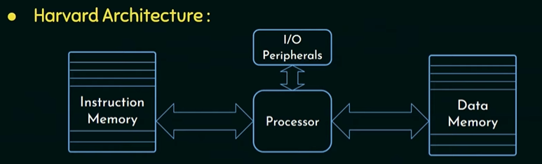
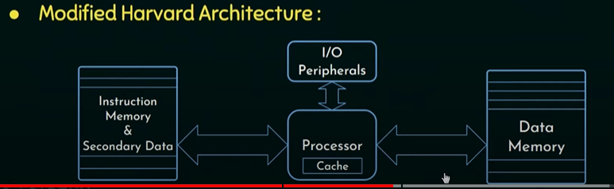
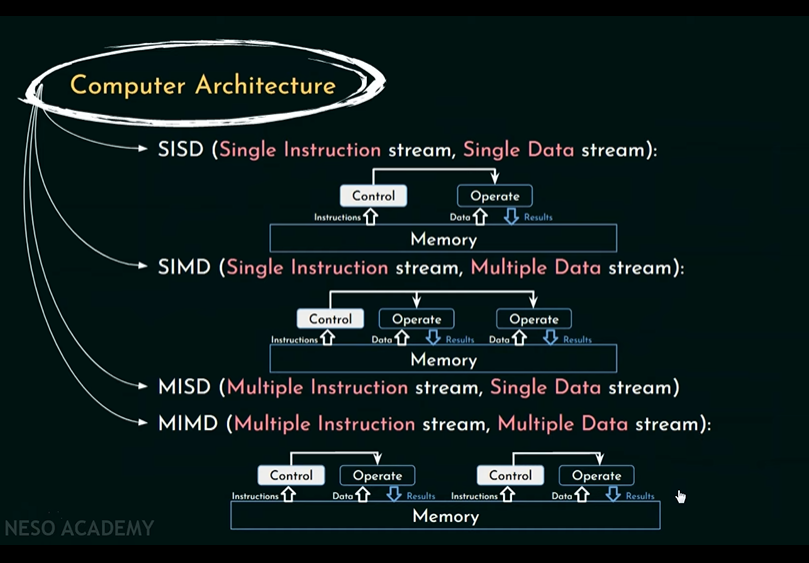

# Computer Architecture

Definition : It is the design of computers, including their instruction sets, hardware components and system organization.  

Architecture -> i) Instructions Set Architecture (ISA)  
                ii) Hardware System Architecture (HSA)  

Computer Architecture -> i) Von Neumann Architecture  
                        ii) Non-Von Neumann Architecture  

  

#
In Harvard Architecture we have separate memory unites, This way way processor can both read data instruction and perform data memory access at same time  
  
#
  

#
