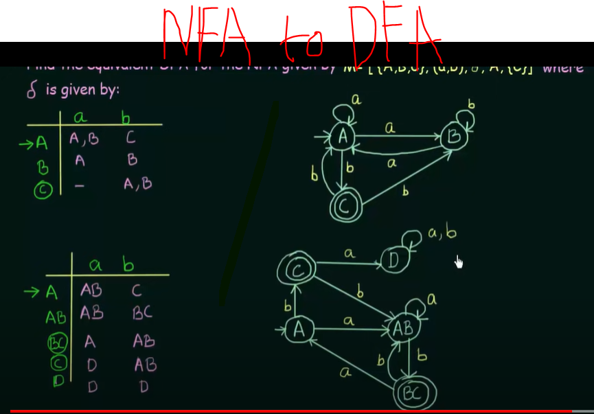

# Level/Layers of Theory of Computation ->

i) FSM -> Finite state machine. (Simplest model of computation, very limited 
amount of memory can Perform very low-level computations)

ii) CFL -> Context Free Language. (little bit powerful than FSM)

iii) Turing machine -> (can perform high-level computation.)

iv) Undecidable -> problem that can't be solved mechanically

#
Symbol -> a,b,c,...,0,1...

Alphabet (denoted by sigma Σ ) -> collections of symbols. Eg. {a,b},{d,e,f,g},{0,1,2}

String -> Sequence of Symbols is known as strings. Eg. a,b,aa,bababab...

Language -> Set of strings.
Eg. Σ = {0,1}, if a Language L1 = set of all Strings of length 2 = {00,01,10,11}

L2 = set of all strings of length 3 = {000,001,010,011,100,101,110,111}

L3 = set of all Strings that begin with 0 = {0,00,01,000,....}

Here L1 And L2 are finite set and L3 is infinite set.

#
Powers of Σ : Σ = {0,1}

Σ^0 = set of all Strings of length 0 : Σ^0 = {ϵ}
Σ^1 = set of all Strings of length 1 : Σ^1 = {0,1}
Σ^2 = set of all Strings of length 2 : Σ^2 = {00,01,10,11}
Σ^3 = set of all Strings of length 3 : Σ^3 = {000,001,010,011,100,101,110,111}

#
Cardinality -> number of elements in a set.
Eg. in Σ^0 the cardinality is 1, in Σ^1 the cardinality is 2

in Σ^n the cardinality is 2^n

#
Σ^* = Σ^0 U Σ^1 U Σ^2 Σ^3 ......
= set of all possible strings of all lengths over Σ

#
Finite State Machine = Finite Automata

Finite Automata -> 1) F A with output
                    i) Moore Machine
                    ii) Mealy Machine

                    2) F A without output
                    i) DFA (Deterministic finite automata)
                    ii) NFA (Nondeterministic Finite Automata)
                    iii) ϵ-NFA

#
DFA (Deterministic finite automata)

edges are called transition here

nodes are called state

Every DFA can be defined using 5 tuples these are

(Q,Σ,q0,F,∂),  here q0 = q not

Q = set of all states

Σ = inputs

q0 = start state / initial state

F = set of final states

∂ = transition function that maps QXΣ→Q (Q cross Sigma to Q)

#
Example of transition function

#
Example of dfa

#
Dead state / trap state -> If a transition goes to a state from which it can never escape

#
A language is said to be a Regular Language if and only if some Finite State Machine recognizes it

Not Regular -> The languages
              >> Which are not recognized by any FSM
              >> Which require memory (Cause FSM can't store or count strings)
FSM has very limited memory it can only store what state it currently present
#
epsilon means empty string
#

#
Theorem 1 : The class of Regular languages is closed under UNION
Theorem 2 : The class of Regular Languages is closed under Concatenation

#
DFA  
  
NFA - Non-deterministic Finite Automata  
  

# NFA

#
If there is any way to run the machine that ends in any set of states out of which at least one state is a final state, then NFA accepts
#
  
  
  
  

#
Every DFA is an NFA, but not vice versa

But there is an equivalent DFA for every NFA

  
  
  
  
#
  
  

#
  

#
  

#
A state is said to be Unreachable if there is no way it can be reached from the Initial State.

# 
If there is unreachable state and we want to minimize the dfa then we will remove unreachable states and next job is the same.